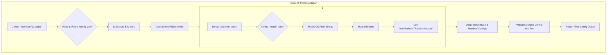

# Plan: `.env` to `config.yaml` Migration

This document outlines the detailed, step-by-step plan to migrate the project's configuration from a `.env` file to a structured `config.yaml`. This migration will improve support for platform-specific features and enhance the overall maintainability of the configuration.

---

### **Phase 1: Foundation & Design**

This phase focuses on setting up the necessary tools and defining the new configuration structure.

*   **Task 1.1: Add YAML Dependency (Completed)**
    *   **Action**: Add the `yaml` package to the project's dependencies.
    *   **Command**: `bun add yaml`

*   **Task 1.2: Define the YAML Schema & Types**
    *   **Action**: The `config.yaml` file will be structured with top-level keys for `paths`, `github`, and `downloader`, and a `platform` section for overrides.
    *   **Action**: The `platform` section will be an array. Each item will have a `match` key, which will be an array of match criteria objects. Each criterion object must contain an `os` key and/or an `arch` key.
    *   **Action**: Create/update `src/types/config.yaml.types.ts` and a Zod schema in `src/modules/config/config.yaml.schema.ts` to validate this specific structure.

*   **Task 1.3: Create Initial `config.yaml`**
    *   **Action**: Create a `config.yaml` file in the project root, translating settings from `.env`.
    *   **Example `config.yaml` structure**:
        ```yaml
        paths:
          dotfiles: ~/.dotfiles
          generated: ${paths.dotfiles}/.generated
          target: /usr/local/bin
          toolConfigs: ${paths.dotfiles}/generator/configs/tools
        github:
          token: ${GITHUB_TOKEN_ENV_VAR} # Allow env var substitution
          cacheEnabled: true
        downloader:
          timeout: 300000

        # Platform-specific overrides. Merged on top of the base config in order.
        platform:
          - match:
              - os: macos
            config:
              paths:
                target: /opt/homebrew/bin 

          - match:
              - os: linux
                arch: arm64
            config:
              downloader:
                timeout: 600000 
        ```

---

### **Phase 2: Implement the New Configuration Loader**

This phase involves building the new logic to read, parse, and process the `config.yaml` file.



*   **Task 2.1: Create the `YamlConfigLoader` Module**
    *   **Action**: Create a new module directory: `src/modules/config-loader/`.
    *   **Action**: Inside, create `IConfigLoader.ts` and `YamlConfigLoader.ts`.

*   **Task 2.2: Implement YAML Loading and Parsing**
    *   **Action**: The `YamlConfigLoader`'s `load()` method will:
        1.  Read the `config.yaml` file.
        2.  Parse the YAML content.
        3.  Implement environment variable substitution (e.g., for `${VAR_NAME}`).

*   **Task 2.3: Implement Platform-Specific Merging**
    *   **Action**: The `YamlConfigLoader` will contain mapping objects to convert YAML strings (e.g., 'macos', 'x86_64') to their corresponding `Platform` and `Architecture` enum values.
    *   **Action**: When iterating through the `platform` section, the loader will check the `match` array. If *any* of the criteria objects in the array match the current system (using `hasPlatform` and `hasArchitecture`), the corresponding `config` block will be merged.
    *   **Action**: It will perform a deep, recursive merge of the top-level config with the `config` block of *all* matching overrides, applied in the order they appear in the file.

*   **Task 2.4: Refactor `createAppConfig`**
    *   **Action**: The existing `createAppConfig` function will be refactored to accept the merged configuration object from the `YamlConfigLoader`.
    *   **Action**: Its main role will be to apply final defaults and resolve derived paths.

---

### **Phase 3: Integration & Test Migration**

*   **Task 3.1: Create New Testing Helper**
    *   **Action**: Create a new testing helper, `createTestConfig(tempDir: string, config: object): string`, that writes a given object to a temporary `config.yaml` file and returns the path.

*   **Task 3.2: Refactor Unit Tests (`config.test.ts`)**
    *   **Action**: Update the tests in `src/modules/config/__tests__/config.test.ts` to pass a mock object representing a parsed and merged `config.yaml` instead of a mock `ConfigEnvironment` object.

*   **Task 3.3: Refactor E2E Tests (`cli-*.e2e.test.ts`)**
    *   **Action**: In the `beforeAll` block of the E2E tests:
        1.  Remove the call to `setupEnvironmentVariables`.
        2.  Instead, use the new `createTestConfig` helper to write a `config.yaml` file inside the temporary test directory.
        3.  Update the `executeCliCommand` call. Instead of passing an `env` object, pass the path to the temporary `config.yaml` via the `--config` command-line argument.

*   **Task 3.4: Integrate `YamlConfigLoader` into the CLI**
    *   **Action**: In `src/cli.ts`, modify `setupServices` to use `YamlConfigLoader` to load the configuration from the path provided by the `--config` option.

---

### **Phase 4: Cleanup and Documentation**

*   **Task 4.1: Remove Old System**
    *   **Action**: Delete the `.env` file.
    *   **Action**: Remove the `dotenv` dependency.
    *   **Action**: Delete the `setupEnvironmentVariables` testing helper.
    *   **Action**: Delete the old `EnvSchema` and `ConfigEnvironment` types.

*   **Task 4.2: Update Memory Bank**
    *   **Action**: Update `memory-bank/techContext.md` and `memory-bank/systemPatterns.md` to describe the new YAML-based configuration system and testing strategy.
    *   **Action**: Update `memory-bank/progress.md` to reflect the completion of this migration.