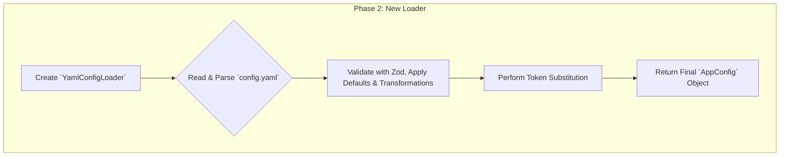

# Plan: `.env` to `config.yaml` Migration

This document outlines the detailed, step-by-step plan to migrate the project's configuration from a `.env` file to a structured `config.yaml`. This migration will improve support for platform-specific features and enhance the overall maintainability of the configuration. The new system will replace the existing `.env` implementation, which is based on the `dotenv` library and the `createAppConfig` function in `src/modules/config/config.ts`.

---

### **Phase 1: Foundation & Schema Design**

This phase focuses on defining the new configuration structure.

*   **Task 1.1: Define the Comprehensive & Optional YAML Schema**
    *   **Action**: The `config.yaml` structure will be designed to logically group all settings currently available in `ConfigEnvironment`. All keys in the YAML file will be optional.
    *   **Action**: Create/update `src/types/config.yaml.types.ts` to define the TypeScript types for this new structure.
    *   **Action**: Create a new Zod schema in `src/modules/config/config.yaml.schema.ts`. This schema will be responsible for applying all default values and transformations.

*   **Task 1.2: Create Initial `config.yaml`**
    *   **Action**: Create a `config.yaml` file in the project root that reflects the new, comprehensive structure. It should serve as a clear example for users, with comments mapping each setting to its corresponding `.env` variable.
    *   **New `config.yaml` structure**:
        ```yaml
        # All keys are optional. If a key is omitted, a default value will be used.
        # Environment variables like ${VAR_NAME} can be used for substitution.

        paths:
          dotfiles: ~/.dotfiles # Maps to DOTFILES_DIR
          shimTarget: /usr/local/bin # Maps to TARGET_DIR
          generated: ${paths.dotfiles}/.generated # Maps to GENERATED_DIR
          toolConfigs: ${paths.dotfiles}/tools # Maps to TOOL_CONFIGS_DIR
          completions: ${paths.generated}/completions # Maps to COMPLETIONS_DIR
          manifest: ${paths.generated}/manifest.json # Maps to GENERATED_ARTIFACTS_MANIFEST_PATH

        system:
          sudoPrompt: "Enter password for generator:" # Maps to SUDO_PROMPT

        logging:
          debug: "dot:*" # Maps to DEBUG

        updates:
          checkOnRun: true # Maps to CHECK_UPDATES_ON_RUN
          checkInterval: 86400 # Maps to UPDATE_CHECK_INTERVAL (in seconds)

        github:
          token: ${GITHUB_TOKEN} # Maps to GITHUB_TOKEN
          host: https://api.github.com # Maps to GITHUB_HOST
          userAgent: "dotfiles-generator" # Maps to GITHUB_CLIENT_USER_AGENT
          cache:
            enabled: true # Maps to GITHUB_API_CACHE_ENABLED
            ttl: 86400000 # Maps to GITHUB_API_CACHE_TTL (in milliseconds)

        downloader:
          timeout: 300000 # Maps to DOWNLOAD_TIMEOUT (in milliseconds)
          retryCount: 3 # Maps to DOWNLOAD_RETRY_COUNT
          retryDelay: 1000 # Maps to DOWNLOAD_RETRY_DELAY (in milliseconds)
          cache:
            enabled: true # Maps to CACHE_ENABLED

        # Platform-specific overrides. Merged on top of the base config in order.
        # This section leverages the existing platform-matching logic defined in `src/types/platform.types.ts`
        # and used by the `ToolConfigBuilder`.
        platform:
          - match:
              - os: macos
            config:
              paths:
                target: /opt/homebrew/bin

          - match:
              - os: linux
                arch: arm64
            config:
              downloader:
                timeout: 600000
        ```

---

### **Phase 2: Implement the New Configuration Loader**

This phase involves building the logic to read and process the `config.yaml` file.



*   **Task 2.1: Implement `YamlConfigLoader`**
    *   **Action**: Create `src/modules/config-loader/YamlConfigLoader.ts`.
    *   **Action**: The `YamlConfigLoader.load(filePath)` method will:
        1.  Read and parse the `config.yaml` file.
        2.  Validate the parsed object against the Zod schema from `config.yaml.schema.ts`. The schema will apply all necessary default values and transformations.
        3.  Perform token substitution for values like `${VAR_NAME}` from both `process.env` and other values within the YAML file (e.g., `${paths.dotfiles}`).
        4.  Return the final, fully-formed `AppConfig` object.

*   **Task 2.2: Deprecate `createAppConfig`**
    *   **Action**: The `createAppConfig` function in `src/modules/config/config.ts` will be deprecated and removed. All of its logic will be moved into the `YamlConfigLoader` and the Zod schema.

---

### **Phase 3: Integration & Testing**

*   **Task 3.1: Create `createTestConfig` Helper**: This remains a valid requirement.
*   **Task 3.2: Refactor Unit & E2E Tests**: This remains a valid requirement. Tests will be updated to use the new helper and pass the `--config` flag.
*   **Task 3.3: Integrate `YamlConfigLoader` into the CLI**: In `src/cli.ts`, `setupServices` will be updated to:
    1.  Instantiate `YamlConfigLoader`.
    2.  Call `loader.load(configPath)` to get the final `AppConfig` object.

---

### **Phase 4: Cleanup and Documentation**

*   **Task 4.1: Remove Old System**: Deprecate and remove `.env` loading via `dotenv` and the `createAppConfig` function.
*   **Task 4.2: Update Memory Bank**: Update all relevant Memory Bank documents to reflect the new, comprehensive, and optional YAML-based configuration system.